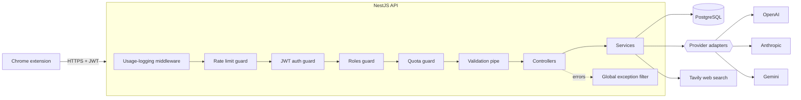
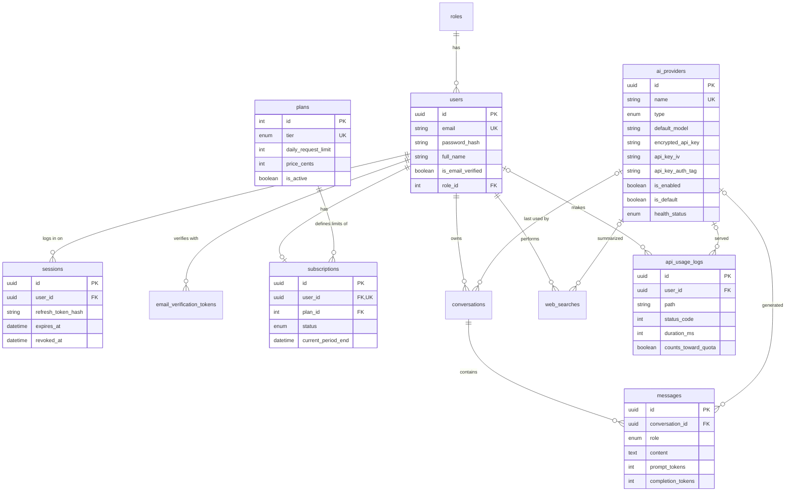

# EchoGPT Backend

Production-ready REST API for the **EchoGPT Chrome extension**: one sidebar for chatting with multiple AI models (OpenAI, Claude, Gemini), summarizing web pages and running AI-assisted web searches.

Built with **NestJS 11, PostgreSQL 16, Prisma 6 and Swagger (OpenAPI 3)**.

> **Try it in one command:** `npm install && npm run setup:env && docker compose --profile app up --build`, then open **http://localhost:3000/docs**.

---

## Contents

- [Features](#features)
- [Quick start](#quick-start)
- [Configuration](#configuration)
- [Using the API](#using-the-api)
- [Architecture](#architecture)
- [Database schema](#database-schema)
- [Design decisions](#design-decisions)
- [API reference](#api-reference)
- [Testing](#testing)
- [Project structure](#project-structure)
- [Limitations and next steps](#limitations-and-next-steps)

---

## Features

| Area | What is implemented |
|---|---|
| **Authentication** | Register, login, logout (current device or all devices), JWT access tokens, refresh tokens with **rotation and reuse detection**, bcrypt password hashing, email verification (bonus), rate-limited credential endpoints, **session management** (list logged-in devices, sign out any one) |
| **User management** | Profile, update profile, change password (logs out other devices), delete account, `USER` / `ADMIN` roles |
| **Subscriptions** | Free and Premium plans, subscription status, upgrade/downgrade, **daily usage quota** enforced by a guard, remaining-requests API |
| **AI providers** | OpenAI, Anthropic (Claude) and Google Gemini behind one adapter interface; add / edit / delete / enable / disable, default provider, **AES-256-GCM encrypted API keys**, health checks that verify the configured model, automatic retries |
| **Chat** | Send a prompt, receive the answer, provider/model selection, conversation history, **Server-Sent Events streaming** (bonus), **page tools** (summarize page, explain selection, ask about the page; page text is never stored), **compare answers from 2-3 models** side by side |
| **Web search** | AI-assisted search (results + cited AI answer), search history, recent searches, autocomplete suggestions, **result caching** (bonus) |
| **Admin panel** | Dashboard statistics, user management, subscription and plan management, provider management, usage analytics, request logs, system health, cleanup job |
| **Docs & tooling** | Swagger for every endpoint (bodies, parameters, per-status error examples, auth), Postman collection, Docker, migrations, seed, unit + e2e tests |

---

## Quick start

**Requirements:** Node.js 20+ (22 LTS recommended), Docker Desktop, Git.

```bash
git clone https://github.com/nfsrishty/echogpt-backend.git
cd echogpt-backend
npm install
npm run setup:env        # creates .env with freshly generated secrets
```

### Option A: everything in Docker

```bash
docker compose --profile app up --build
```

The API container applies migrations, seeds roles, plans and the admin account, then starts. Open **http://localhost:3000/docs**.

### Option B: local development (hot reload)

```bash
docker compose up -d                          # PostgreSQL only (host port 5433)
npx prisma migrate dev                        # apply migrations
npm run db:seed                               # roles, plans, admin account
npm run start:dev                             # http://localhost:3000
```

| URL | What |
|---|---|
| http://localhost:3000/docs | Swagger UI |
| http://localhost:3000/docs/json | OpenAPI document |
| http://localhost:3000/api/v1/health | Public health probe |

**Seeded admin:** `admin@echogpt.local` / `ChangeMe123!` (set by `SEED_ADMIN_EMAIL` / `SEED_ADMIN_PASSWORD`; change them for any real deployment).

> On Windows PowerShell, if `npm`/`npx` are blocked by the execution policy, run `Set-ExecutionPolicy -Scope CurrentUser RemoteSigned` once, or use Git Bash.

---

## Configuration

All variables are validated at startup with Joi: the app refuses to boot with a missing or malformed value. See [`.env.example`](.env.example).

| Variable | Required | Default | Purpose |
|---|---|---|---|
| `DATABASE_URL` | yes | | PostgreSQL connection string |
| `JWT_ACCESS_SECRET` | yes | | Signs access tokens (min. 32 chars) |
| `JWT_REFRESH_SECRET` | yes | | Signs refresh tokens (different from the access secret) |
| `ENCRYPTION_KEY` | yes | | 64 hex chars (32 bytes): AES-256 key for provider API keys |
| `JWT_ACCESS_EXPIRES_IN` | | `15m` | Access token lifetime |
| `JWT_REFRESH_EXPIRES_IN` | | `7d` | Refresh token lifetime |
| `PORT` | | `3000` | HTTP port |
| `CORS_ORIGINS` | | `*` | Comma-separated origins, e.g. `chrome-extension://<id>` |
| `TAVILY_API_KEY` | | empty | Web search key. Empty = Tavily **keyless mode** (works out of the box, lower limits) |
| `TAVILY_BASE_URL` | | `https://api.tavily.com` | Search API base URL |
| `SEARCH_CACHE_TTL_SECONDS` | | `3600` | Search cache lifetime (`0` disables caching) |
| `SEED_ADMIN_EMAIL` / `SEED_ADMIN_PASSWORD` | | | First admin account created by the seed |

`npm run setup:env` fills the three secrets with random values; it refuses to overwrite an existing `.env` unless run with `-- --force`.

---

## Using the API

1. **Log in:** `POST /api/v1/auth/login` with the seeded admin. Copy `accessToken`, click **Authorize** in Swagger and paste it.
2. **Add an AI provider** (admin): `POST /api/v1/providers`. The request body has an **Examples** dropdown for OpenAI, Claude and Gemini. A free Gemini key is available from Google AI Studio. Leave `baseUrl` empty to use the official endpoint.
3. **Check it:** `POST /api/v1/providers/{id}/health-check` sends a tiny prompt to the configured model.
4. **Chat:** `POST /api/v1/chat/messages` with `{"message": "Hello"}`. Continue with the returned `conversationId`.
5. **Stream:** `POST /api/v1/chat/messages/stream` returns `text/event-stream`:
   ```bash
   curl -N -X POST http://localhost:3000/api/v1/chat/messages/stream \
     -H "Authorization: Bearer <accessToken>" -H "Content-Type: application/json" \
     -d '{"message": "Write a haiku about the sea"}'
   ```
   Events: `meta` (conversation, provider, model), `delta` (text chunks), `done` (message id, token usage) or `error`.
6. **Page tools:** the extension's "Summarize" and "Explain" buttons map to `action`:
   ```json
   { "action": "SUMMARIZE_PAGE", "pageContext": { "url": "https://…", "title": "…", "content": "<visible page text>" } }
   { "action": "EXPLAIN_SELECTION", "pageContext": { "title": "…", "selection": "<selected text>" } }
   ```
   `message` is optional for these actions. The page text is used for that request only and is never stored.
7. **Compare models:** `POST /api/v1/chat/compare` with `{"message": "…", "providerIds": ["<id1>", "<id2>"]}` returns each model's answer side by side.
8. **Search:** `POST /api/v1/search` with `{"query": "latest AI news"}` returns web results and an AI answer citing them as [1], [2].
9. **Sessions:** `GET /api/v1/auth/sessions` lists logged-in devices (e.g. "Chrome on Windows", `current: true`); `DELETE /api/v1/auth/sessions/{id}` signs one out immediately.

**Postman:** import [`postman/EchoGPT-API.postman_collection.json`](postman/EchoGPT-API.postman_collection.json). Run **Auth → Log in** first: tokens are saved automatically, and requests that return IDs (conversation, provider, user) save them for the following requests.

---

## Architecture

The code is organized as **feature modules** (auth, users, subscriptions, providers, chat, search, admin, health) on top of shared infrastructure in `src/common`. Controllers only handle HTTP; services hold business logic; Prisma is the only data access layer.



**Request lifecycle.** Every request passes, in order: the **usage-logging middleware** (records method, path, status, latency, tokens after the response; runs first so it also sees rejected requests), the **rate-limit guard** (100 req/min per IP; 5/min on login, register and resend-verification), the **JWT guard** (signature plus a check that the session still exists), the **roles guard** (`@Roles(ADMIN)`), the **quota guard** (daily plan limit on AI routes), and the **validation pipe** (whitelisting DTOs: unknown fields are rejected). Any error becomes one JSON shape through the global exception filter:

```json
{ "statusCode": 404, "error": "Not Found", "message": "Conversation not found", "path": "/api/v1/chat/conversations/…", "timestamp": "…" }
```

**Provider adapters.** OpenAI, Anthropic and Gemini differ in auth headers, where the system prompt goes, role names and streaming formats. Each is wrapped in an adapter implementing one interface (`chat`, `stream`, `healthCheck`); chat and search code never know which vendor they are talking to. Adding a provider means adding one class.

---

## Database schema

Normalized PostgreSQL schema managed by Prisma; migrations live in [`prisma/migrations`](prisma/migrations). Tables use `snake_case`, primary keys are UUIDs (not enumerable in URLs), and foreign keys are indexed.



Also: `roles`, `conversations`, `email_verification_tokens`, `web_searches` and `search_cache` (shared cache keyed by a hash of the normalized query). Deleting a user cascades to their sessions, subscription, conversations and searches, while their `api_usage_logs` are kept with `user_id = NULL` so statistics stay correct.

---

## Design decisions

| Decision | Why |
|---|---|
| **Refresh token rotation with reuse detection** | Each refresh token works once. Presenting an already-used token proves it was copied, so the whole session is revoked. Only a SHA-256 hash of the token is stored. |
| **Session check on every request** | A JWT alone stays valid until it expires. The guard also checks the session row (one primary-key lookup), so logout and forced logout take effect immediately, and role changes apply on the next request. |
| **bcrypt for passwords, SHA-256 for tokens** | Passwords are guessable and need a slow hash (bcrypt, cost 12). Tokens are long random values, and bcrypt ignores input beyond 72 bytes, which would make distinct JWTs compare equal. Passwords are capped at 72 characters for the same reason. |
| **Same response for "unknown email" and "wrong password"** | Identical message and timing (a dummy bcrypt comparison runs for unknown emails), so login cannot be used to discover registered emails. |
| **API keys encrypted, never hashed** | The original key is needed to call the provider. AES-256-GCM with a random IV per encryption; the auth tag detects tampering. Keys are never returned, only masked (`••••a1B2`). |
| **Quota counted from the request log** | Remaining requests = plan limit minus successful AI requests since 00:00 UTC in `api_usage_logs`. No separate counter to drift; failed AI calls do not consume quota. |
| **Lazy subscription expiry** | An expired Premium period reverts to Free when next read, so no scheduled job is needed. |
| **Retry only temporary provider failures** | 429 and 5xx are retried twice (after 0.5 s and 1.5 s, honoring `Retry-After`); 401/404 fail immediately. After retries, "provider busy" surfaces as `503`, not a generic `502`. |
| **Health checks send a real prompt** | Listing models would pass for a retired model. A tiny prompt validates the key, the model name and availability together. |
| **Streaming waits for the first chunk** | SSE headers lock the status at 200. Waiting for the provider's first chunk lets immediate failures return a proper JSON error; later failures send an `error` event and do not consume quota. Client disconnects abort the upstream request and keep the partial answer. |
| **Page content is untrusted and never stored** | Web pages can contain text like "ignore your instructions". Page text is wrapped in labelled tags and the model is told to treat it as data only. Only the short instruction ("Summarize this page") is saved; long pages are truncated to 30,000 characters, and the JSON body limit is 1 MB. |
| **Compare degrades gracefully** | All providers are called in parallel; one failing returns an `error` for that model while the others still answer. Only if every model fails is a 502 returned. |
| **Chat is saved only after the answer exists** | Question and answer are written in one transaction, so failed calls leave no orphan messages. |
| **Search cache key includes the AI provider** | The same query summarized by different models gives different answers. Failed summaries are never cached. |
| **Privacy-preserving suggestions** | Autocomplete shows your own history, plus queries searched by at least 3 different users in the last 30 days, so one person's private searches are never suggested to others. LIKE wildcards in user input are escaped. |
| **Admin safety rails** | Admins cannot change their own role, delete themselves from the admin panel, or remove the last admin. |
| **Request logging as middleware** | Guards run before interceptors, so an interceptor would miss rejected requests (401/403/429). The middleware logs after the response, fire-and-forget, never slowing the request; it also handles client disconnects. |

---

## API reference

Every endpoint is documented in Swagger with parameters, request bodies (with ready-made examples), response schemas, per-status error examples and auth requirements. All paths are relative to **`/api/v1`**. **Access:** Public (no token), User (any authenticated user), Admin (`ADMIN` role).

**Auth**

| Method | Path | Access | Description |
|---|---|---|---|
| `POST` | `/auth/register` | Public | Register a new account |
| `POST` | `/auth/login` | Public | Log in |
| `POST` | `/auth/refresh` | Public | Refresh the token pair |
| `POST` | `/auth/logout` | User | Log out of the current device |
| `POST` | `/auth/logout-all` | User | Log out of all devices |
| `GET` | `/auth/sessions` | User | List my active sessions (logged-in devices) |
| `DELETE` | `/auth/sessions/{id}` | User | Sign out one of my devices |
| `POST` | `/auth/verify-email` | Public | Verify an email address with the emailed token |
| `POST` | `/auth/resend-verification` | User | Resend the email verification token |

**Users**

| Method | Path | Access | Description |
|---|---|---|---|
| `GET` | `/users/me` | User | Get my profile |
| `PATCH` | `/users/me` | User | Update my profile |
| `DELETE` | `/users/me` | User | Delete my account |
| `PATCH` | `/users/me/password` | User | Change my password |

**Subscriptions**

| Method | Path | Access | Description |
|---|---|---|---|
| `GET` | `/subscriptions/plans` | Public | List available plans |
| `GET` | `/subscriptions/me` | User | Get my subscription status |
| `PATCH` | `/subscriptions/me` | User | Upgrade or downgrade my plan |
| `GET` | `/subscriptions/me/usage` | User | Get my usage and remaining requests for today |

**AI Providers**

| Method | Path | Access | Description |
|---|---|---|---|
| `GET` | `/providers/available` | User | List enabled providers (for the model picker) |
| `GET` | `/providers/health` | Admin | Health-check every enabled provider |
| `GET` | `/providers` | Admin | List all providers |
| `POST` | `/providers` | Admin | Add a provider |
| `GET` | `/providers/{id}` | Admin | Get a provider |
| `PATCH` | `/providers/{id}` | Admin | Edit a provider |
| `DELETE` | `/providers/{id}` | Admin | Delete a provider |
| `PATCH` | `/providers/{id}/status` | Admin | Enable or disable a provider |
| `PATCH` | `/providers/{id}/default` | Admin | Make this the default provider |
| `POST` | `/providers/{id}/health-check` | Admin | Health-check one provider |

**Chat**

| Method | Path | Access | Description |
|---|---|---|---|
| `POST` | `/chat/messages` | User | Send a prompt and receive the AI response |
| `POST` | `/chat/messages/stream` | User | Send a prompt and stream the response (Server-Sent Events) |
| `POST` | `/chat/compare` | User | Compare answers from 2-3 AI models side by side |
| `GET` | `/chat/conversations` | User | List my conversations (newest activity first) |
| `GET` | `/chat/conversations/{id}` | User | Get a conversation with its full message history |
| `PATCH` | `/chat/conversations/{id}` | User | Rename a conversation |
| `DELETE` | `/chat/conversations/{id}` | User | Delete a conversation and its messages |

**Web Search**

| Method | Path | Access | Description |
|---|---|---|---|
| `POST` | `/search` | User | Search the web, with an optional AI answer citing the results |
| `GET` | `/search/history` | User | My search history (newest first) |
| `DELETE` | `/search/history` | User | Clear my whole search history |
| `GET` | `/search/recent` | User | My recent distinct searches |
| `GET` | `/search/suggestions` | User | Autocomplete suggestions for a partial query |
| `DELETE` | `/search/history/{id}` | User | Delete one entry from my search history |

**Admin · Dashboard & Analytics**

| Method | Path | Access | Description |
|---|---|---|---|
| `GET` | `/admin/dashboard` | Admin | Dashboard statistics: users, plans, activity, providers |
| `GET` | `/admin/analytics/usage` | Admin | API usage analytics over the last N days |
| `GET` | `/admin/logs` | Admin | Request logs (newest first) |

**Admin · Users**

| Method | Path | Access | Description |
|---|---|---|---|
| `GET` | `/admin/users` | Admin | List and search users |
| `GET` | `/admin/users/{id}` | Admin | User details, subscription, today's usage and activity stats |
| `DELETE` | `/admin/users/{id}` | Admin | Delete a user and all their data |
| `PATCH` | `/admin/users/{id}/role` | Admin | Change a user's role |
| `PATCH` | `/admin/users/{id}/subscription` | Admin | Grant, extend or remove a user's plan |
| `POST` | `/admin/users/{id}/revoke-sessions` | Admin | Force-logout a user from every device |

**Admin · Subscriptions**

| Method | Path | Access | Description |
|---|---|---|---|
| `GET` | `/admin/subscriptions` | Admin | List subscriptions (filter by tier/status) |
| `GET` | `/admin/plans` | Admin | List all plans, including inactive ones |
| `PATCH` | `/admin/plans/{tier}` | Admin | Edit a plan (limit, price, name, active) |

**Admin · System**

| Method | Path | Access | Description |
|---|---|---|---|
| `GET` | `/admin/system/health` | Admin | Detailed system health |
| `POST` | `/admin/system/cleanup` | Admin | Delete expired sessions, verification tokens and cache entries |

**Health**

| Method | Path | Access | Description |
|---|---|---|---|
| `GET` | `/health` | Public | Public health probe (API + database) |

---

## Testing

```bash
npm test             # unit tests: encryption, SSE parsing, retry logic, page-tool prompts, utilities
npm run test:e2e     # end-to-end auth flow against the real database
npm run lint
```

`test:e2e` needs PostgreSQL running with migrations and seed applied (Quick start, option B). It creates its own uniquely-named users and deletes them afterwards. The e2e test boots the app through the same `configureApp()` function as `main.ts`, so it exercises exactly the configuration that ships.

---

## Project structure

```
src/
├── admin/            dashboard, analytics, request logs, user & plan management, system health
├── auth/             register, login, refresh rotation, logout, email verification
├── chat/             messages, SSE streaming, page tools, compare, conversation history
├── common/
│   ├── crypto/       AES-256-GCM service for provider API keys
│   ├── decorators/   @Public, @Roles, @CurrentUser, @ConsumesQuota, @ApiAuth
│   ├── filters/      global exception filter (single error shape)
│   ├── guards/       JWT auth guard, roles guard
│   ├── middleware/   API usage / request logging
│   ├── swagger/      per-status error examples for the OpenAPI document
│   └── utils/        hashing, passwords, SQL, user-agent helpers
├── config/           environment validation (Joi)
├── health/           public health probe
├── mail/             mail service (logs emails in development)
├── prisma/           PrismaService
├── providers/        provider CRUD, health checks, adapters (OpenAI, Anthropic, Gemini)
├── search/           web search, cache, history, suggestions
├── subscriptions/    plans, upgrades, usage quota guard
├── users/            profile, password, account deletion
├── app.module.ts
├── app.setup.ts      shared app configuration (main.ts + e2e tests)
└── main.ts
prisma/               schema, migrations, seed
test/                 e2e tests
postman/              Postman collection
scripts/              setup-env
```

| Script | Purpose |
|---|---|
| `npm run start:dev` | Start with hot reload |
| `npm run build` / `npm run start:prod` | Compile / run the compiled app |
| `npm run setup:env` | Create `.env` with generated secrets |
| `npm run db:migrate` / `db:deploy` | Create & apply migrations (dev) / apply only (prod) |
| `npm run db:seed` / `db:studio` | Seed data / browse the database |
| `npm test` / `test:e2e` / `lint` | Unit tests / e2e tests / lint |

---

## Limitations and next steps

These are conscious scope decisions for this assignment:

- **Payments:** upgrading grants a 30-day Premium period directly; in production this would run from a payment provider's webhook.
- **Email:** verification tokens are logged to the console by `MailService`; plugging in SMTP or an email API only changes that class.
- **Google sign-in** (shown in the extension) is not implemented.
- **Horizontal scaling:** rate limiting uses in-memory storage. Running several instances would need a shared store (e.g. Redis) for the throttler, and a queue for usage-log writes at high volume.
- **One default provider** is enforced in a transaction; a partial unique index in the database would be a further safeguard.
- **Compare** counts as one request toward the daily quota even though it calls 2-3 models; a per-request quota cost would need an extra column.

---

_Author: Nahian Faiza Firdows_
